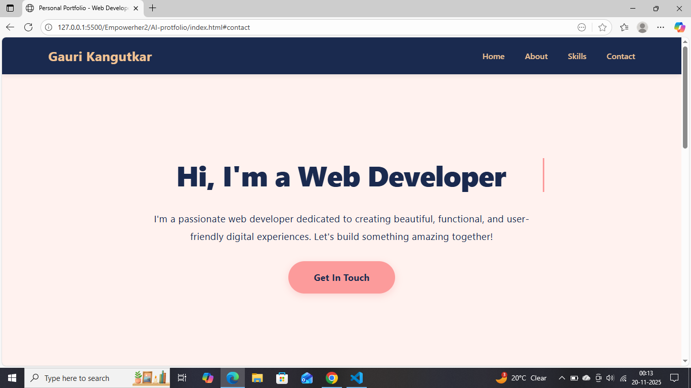
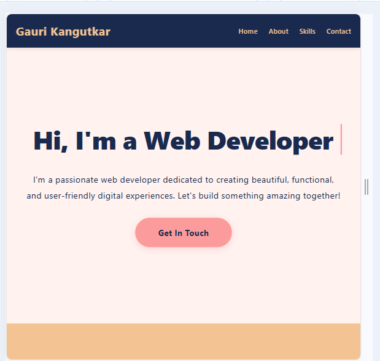
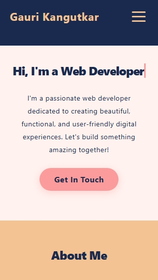

# Responsive Personal Portfolio Page (Using AI Tools)
## Objective
###### Build a responsive Personal Portfolio Webpage using HTML + CSS only with AI website-building tools.

## Used AI tool:

**v0 by Vercel**  

## Manually changes:

* Fixed typing animation. 
* Added all of my details.
* Changed font size.
* Updated styling of skill section.
* Updated responsiveness for Small screen.

## Images

